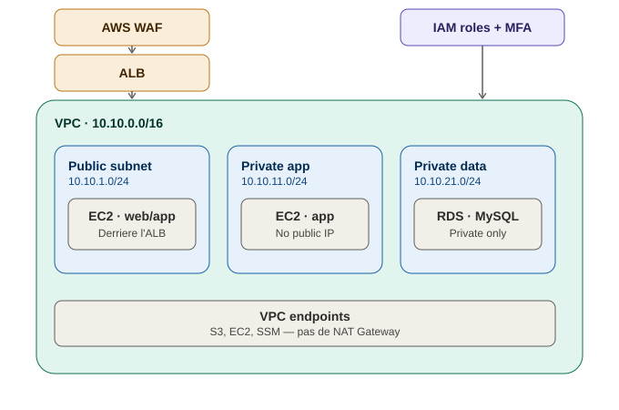
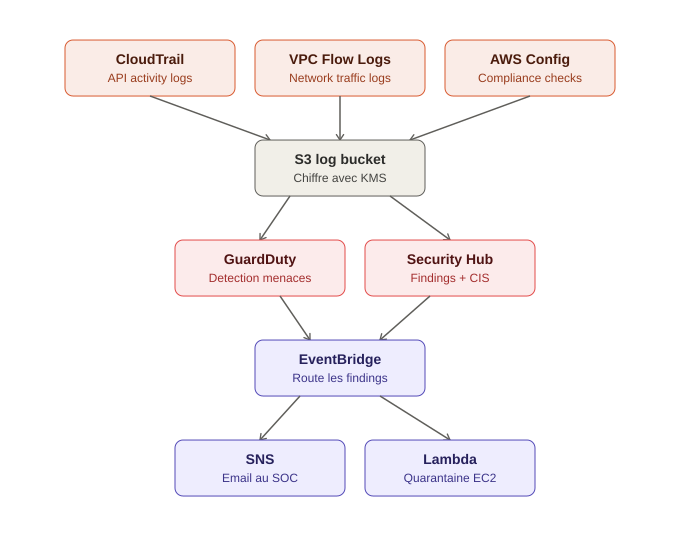

# AWS Cloud Security & Automated Incident Response Lab

## Overview

This project implements a secure AWS environment designed to demonstrate
cloud security monitoring, threat detection, and automated incident response.

The infrastructure is deployed using Terraform and follows security principles
such as least privilege, network segmentation, centralized logging, encryption,
and continuous security monitoring.

The project also includes controlled attack simulations to validate the
detection and response capabilities of the environment.

## Architecture

### Network & compute



### Detection & automated response



## Architecture Components

### Network
- VPC: `10.10.0.0/16`
- Public Subnet: `10.10.1.0/24`
- Private Application Subnet: `10.10.11.0/24`
- Private Data Subnet: `10.10.21.0/24`
- VPC Endpoints (no NAT Gateway)
- Application Load Balancer
- AWS WAF

### Compute & Data
- Amazon EC2
- Amazon RDS MySQL
- Amazon S3

### Identity & Security
- AWS IAM
- MFA
- Least Privilege
- AWS KMS

### Monitoring & Detection
- AWS CloudTrail
- VPC Flow Logs
- AWS Config
- Amazon GuardDuty
- AWS Security Hub

### Automated Incident Response
- Amazon EventBridge
- Amazon SNS
- AWS Lambda
- EC2 Quarantine Security Group

## Detection & Response Workflow

```
GuardDuty / Security Hub
        |
   EventBridge
      /      \
    SNS      Lambda
     |          |
   Alert   Quarantine EC2
```

The automated response workflow detects high-severity security findings,
notifies the SOC analyst, and isolates potentially compromised EC2 instances
by replacing their Security Group with a quarantine Security Group.

## Security Scenarios

The following controlled scenarios are tested:

1. Exposed Security Group
2. IAM Privilege Escalation
3. Network Port Scanning
4. Malicious Web Request (SQLi/XSS) — blocked by AWS WAF

Each scenario includes:

- Attack simulation
- Detection
- Log analysis
- Investigation
- Remediation
- Lessons learned

## Infrastructure as Code

The AWS infrastructure is deployed using Terraform.

Terraform modules are organized by functionality:

- Networking
- IAM
- Compute
- Logging
- Security
- Incident Response

## Project Roadmap

- [ ] Phase 1 — Terraform & Networking
- [ ] Phase 2 — EC2, RDS, ALB & WAF
- [ ] Phase 3 — Logging & Detection
- [ ] Phase 4 — Attack Simulations
- [ ] Phase 5 — Automated Incident Response
- [ ] Phase 6 — Documentation & Cleanup

### Planned V2

- Multi-AZ deployment
- Elastic Stack integration (CloudTrail / GuardDuty -> Elasticsearch -> Kibana)
- SOAR integration (Shuffle, MISP, TheHive, Cortex)
- Automated "Restrict Access" response (IP / IAM role blocking)

## Disclaimer

All attack simulations are performed against infrastructure created and
controlled by the project owner for educational purposes.

## Author

Marouane Chtita
